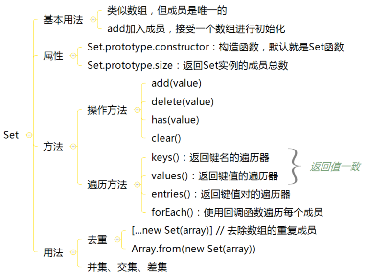
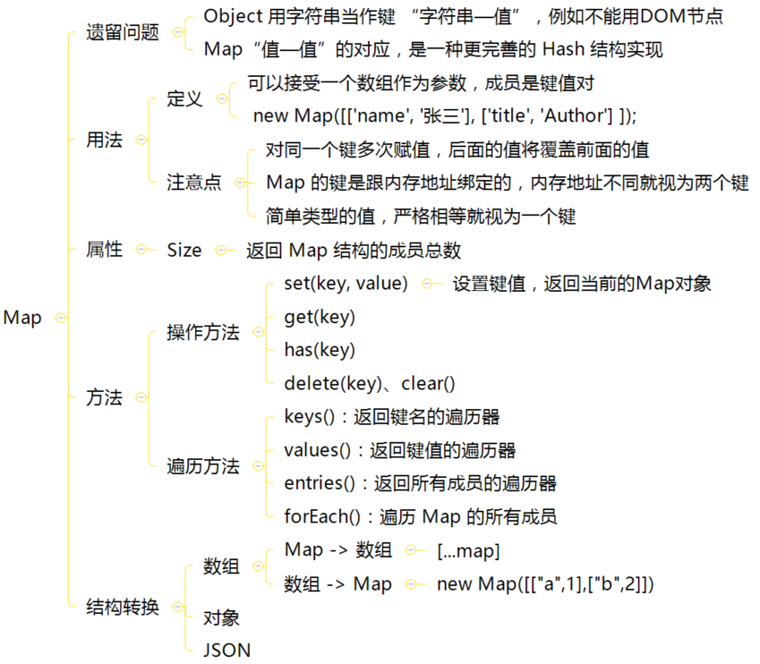
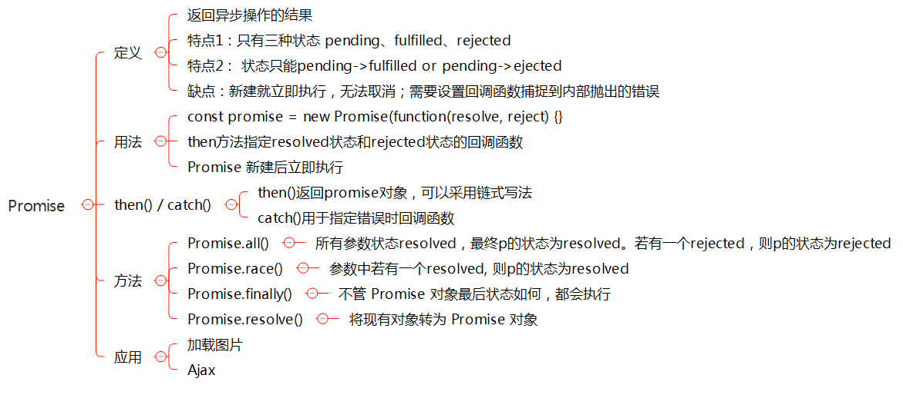
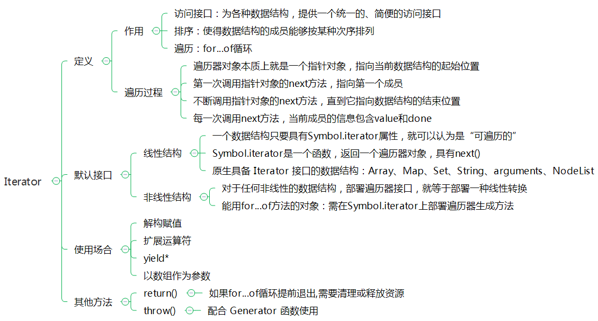
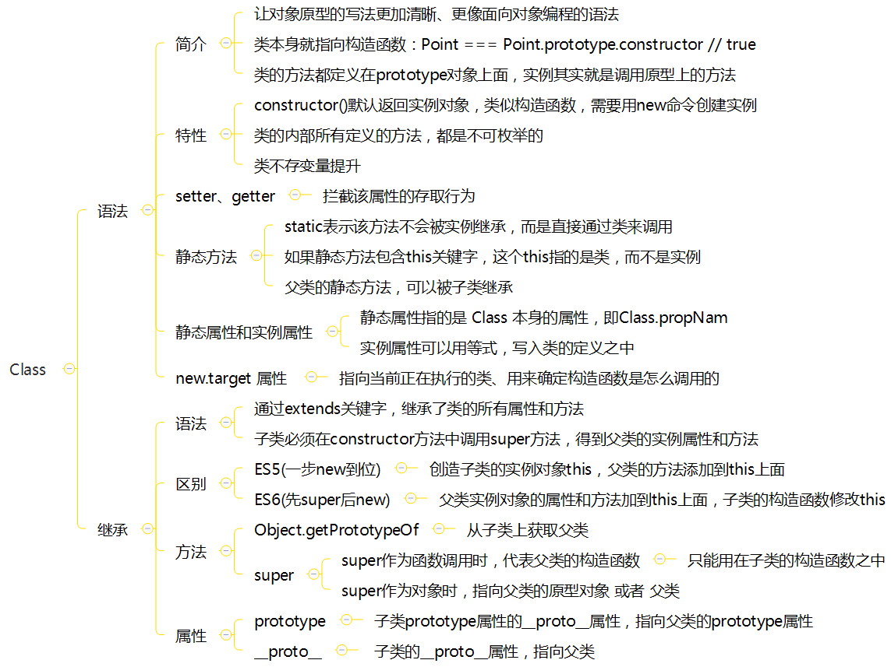

## ES6

> *每日一话：你简直就像这篇代码，越看越想睡*

### let const

<div align=center>


</div>

### 解构赋值

<div align=center>


</div>

### 字符串扩展

<div align=center>


</div>

### 数值扩展

<div align=center>


</div>

### 函数扩展

<div align=center>


</div>

```javascript
/* 参数的默认值 - 基本 */
function sum(x, y = 10) {
  return x + y;
}

console.log(sum(1)); // 11
console.log(sum(1, 2)); // 3

/* 参数的默认值 - 解构赋值 */
function fn({x, y = 5}) {
  console.log(x, y);
}

fn({}); // undefined 5
fn({x: 1}); // 1 5
fn({x:1, y: 2}); // 1 2
fn(); // 报错，函数没有默认值，无法解构赋值

/* 参数的默认值 - Length */
(function (a) {}).length // 1
(function (a = 5) {}).length // 0
(function (a, b, c = 5) {}).length // 2

/* 参数的默认值 - 作用域 */
var x = 1; // y=x,y指向x,x指向f(2)
function f(x, y = x) {
  console.log(y);
}
f(2) // 2

let x = 1;
function f(y = x) { // y=x,y指向x,x指向全局变量x
  let x = 2;
  console.log(y);
}
f() // 1

/* rest参数 */
function add(...values) {
  let sum = 0;
  for (let val of values)
    sum += val;
  return sum;
}
console.log(add(1, 2, 3)); // 6

// 报错
function fn(a, ...b, c) {
  // ...
}

/* 箭头函数 - 用法 */
// 如果只有一个参数，可以不用加 ()
// 如果函数只有一条语句，并且是 return 语句，可以省略 return
let square = x => x * x;
console.log(square(2)); // 4


// 如果函数代码块部分多余一条语句，就要用大括号括起来
let sum = (a, b) => {
  let c = a + b;
  return c;
};
console.log(sum(1, 2)); // 3


// 如果函数返回一个对象，需要加上() 以免解析成代码块
// 当然如果不嫌麻烦完全可以直接用 {} 限定代码块，加上 return 语句
let f = () => ({name: 'hanzichi'});
console.log(f()); // { name: 'hanzichi' }


// 和变量解构结合使用
let full = ({first, last}) => first + ' ' + last;
let person = {first: 'hello', last: 'world'};
console.log(full(person)); // Han Zichi

/* 箭头函数 - this */
function foo() {
  setTimeout(() => {
    console.log('id:', this.id);
  }, 1000);
}
var id = 21;
foo.call({ id: 42 }); // id: 42

function Timer() {
  this.s1 = 0;
  this.s2 = 0;
  // this 绑定定义时所在的作用域
  setInterval(() => this.s1++, 1000);
  // this 指向运行时所在的作用域
  setInterval(function() {
    // NaN
    this.s2++;
  }, 1000);
}
let timer = new Timer();
setTimeout(() => console.log(timer.s1, timer.s2), 3100); // 3 0

/* 尾调用 - 定义*/
// 尾调用不一定出现在函数尾部，只要是最后一步操作即可
function f(x) {
  if (x > 0) {
    return m(x);
  }
  return n(x);
}

/* 尾调用 - 尾调用优化*/
// 如果函数 g 不是尾调用，函数 f 就需要保存内部变量 m 和 n 的值、g 的调用位置等信息。
// 但是由于调用 g 之后，函数就结束了，
// 所以执行到最后一步，完全可以删除 f(x) 的调用帧，只保留 g(3) 的调用帧

function f() {
  let m = 1;
  let n = 2;
  return g(m + n);
}
fn();
// 等同于
function f() {
  return g(3);
}
// 等同于
g(3);

// 只有不再用到外层函数的内部变量，内层函数的调用帧才会取代外层函数的调用帧，否则就无法进行 "尾调用优化"
function addOne(a) {
  let one = 1;
  function inner(b) {
    return b + one;
  }
  return inner(a);
}

/* 尾调用 - 尾递归*/
// 尾调用自身，就称为尾递归
// 只存在一个调用帧
function fibonacci(n, a = 1, b = 1) {
  if (n <= 1) return b;
  return fibonacci(n - 1, b, a + b);
}
fibonacci(5) // 8
```

### 数组扩展

<div align=center>


</div>

### 对象扩展

<div align=center>


</div>

```javascript

/* 对象扩展 - 属性简洁表示法 */ 
let a=1;
let b=2;
let es5={
  a:a,
  b:b
};
let es6={
  a,
  b
};
console.log(es5,es6); // ​​​​​{ a: 1, b: 2 } { a: 1, b: 2 }​​​​​

let es5_method={
  hello:function(){
    console.log('hello');
  }
};
let es6_method={
  hello(){
    console.log('hello');
  }
};
console.log(es5_method.hello(),es6_method.hello());

/* 对象扩展 - Object.is() */ 
console.log(Object.is('foo','foo'),'foo'==='foo'); // true true​​​​​
console.log(Object.is(+0,-0),+0===-0); // ​​​​​false true
console.log(Object.is(NaN,NaN),NaN===NaN); // ​​​​​true false​​​​​

/* 对象扩展 - Object.assign() */ 
const target = { a: 1, b: 1 };
const source1 = { b: 2, c: 2 };
const source2 = { c: 3 };
Object.assign(target, source1, source2);
target // {a:1, b:2, c:3}

// undefined和null无法转成对象
Object.assign(undefined) // 报错
Object.assign(null) // 报错

//  Object.assign 拷贝源对象自身属性+可枚举
Object.assign({b: 'c'},
  Object.defineProperty({}, 'invisible', {
    enumerable: false,
    value: 'hello'
  })
) // { b: 'c' }

// 完整克隆一个对象
function clone1(obj) {
  const clone = Object.assign(
    Object.create(Object.getPrototypeOf(obj)),
    obj
  );
  return clone
}

function clone2(obj) {
  // create 第一个参数是对象的原型，第二参数是描述对象
  const clone = Object.create(
    Object.getPrototypeOf(obj),
    Object.getOwnPropertyDescriptors(obj)
  )
  return clone
}

// 数组视为对象处理
Object.assign([1, 2, 3], [4, 5]) // [4, 5, 3]

// 扩展运算符： 取出参数对象的所有可遍历属性，拷贝到当前对象之中。
let z = { a: 3, b: 4 };
let n = { ...z };
n // { a: 3, b: 4 }
```  

### Symbol

<div align=center>


</div>

### Set、Map

<div align=center>





</div>

```javascript
/* Set */
// 可以接受数组或者类数组作为参数初始化
let s = new Set();

// add()
[1, 2, 3, 4, 3, 2, 1].forEach(x => s.add(x));

console.log(s.size); // 4

// delete()
let isDeleted = s.delete(4);
console.log(isDeleted); // true

// has()
let hasFour = s.has(4);
console.log(hasFour); // false

// Set -> Array
// 方法一
let a = [...s]; // [ 1, 2, 3 ]
// 方法二
let b = Array.from(s); // [ 1, 2, 3 ]

// 遍历
// 因为 Set 的 key 和 value 可以看做一致
let set = new Set(['red', 'green', 'blue']);

for (let item of s.keys()) {
  console.log(item);
}
for (let item of s.values()) {
  console.log(item);
}
// red
// green
// blue

for (let item of s.entries()) {
  console.log(item);
}
// ["red", "red"]
// ["green", "green"]
// ["blue", "blue"]

// clear
s.clear();
console.log(s.size); // 0

/* Map */
// Map 可以接受一个数组作为参数
// 该数组的成员是一个个表示键值对的数组
let m = new Map([
  ['a', 1],
  ['b', 2]
]);

// set
m.set('c', 3);

// get
console.log(m.get('a')); // 1
console.log(m.get('d')); // undefined

// delete
let isDeleted = m.delete('a');
console.log(isDeleted); // true

// has
console.log(m.has('a')); // false

console.log(m.size); // 2

// 遍历
for (let item of m.entries()) {
  console.log(item);
}
// [ 'b', 2 ]
// [ 'c', 3 ]

const items = [
  ['name', '张三'],
  ['title', 'Author']
];
const map = new Map();
items.forEach(
  ([key, value]) => map.set(key, value)
);

// Map -> Array
console.log([...map])
// [ [ 'name', 张三 ],
//   [ 'title', Author ] ]

console.log([...m.keys()]);
// [ 'name', 'title']

console.log([...m.values()]);
// [ 张三, Author]
```

### Proxy、Reflect

<div align=center>


</div>

### Promise 对象

<div align=center>



</div>

```javascript
// 链式操作
let ajax=()=>{
  return new Promise((resolve,reject)=>{
    setTimeout( ()=> {
      resolve()
    }, 1000);
  })
};

ajax()
  .then(()=>{
  return new Promise((resolve,reject)=>{
    setTimeout( () => {
      resolve()
    }, 1000);
  });
  })
  .then(()=>{
  console.log('timeout'); 
})

// 事件一的结果作为事件二的参数
let async1 = () => {
  let p1 = new Promise((resolve, reject) => {
    resolve(1);
  });
  return p1;
};

// first 为前次异步操作的返回值
let async2 = (first) => {
  let p2 = new Promise((resolve, reject) => {
    resolve(first + 2);
  });
  return p2;
};

async1().then(data => {
  return async2(data);
}).then(data => console.log(data)); // 3

 // 所有图片加载完再添加到页面
function loadImg(src){
  return new Promise((resolve,reject)=>{
    let img=document.createElement('img');
    img.src=src;
    img.onload=function(){
      resolve(img);
    }
    img.onerror=function(err){
      reject(err);
    }
  })
}
function showImgs(imgs){
  imgs.forEach(function(img){
    document.body.appendChild(img);
  })
}

Promise.all([
  loadImg('http://www.baidu.com/1.png'),
  loadImg('http://www.baidu.com/2.png'),
  loadImg('http://www.baidu.com/3.png')
]).then(showImgs)
```

### Iterator 和 for...of循环

<div align=center>



</div>

```javascript
// 模拟next方法，遍历器生成函数makeIterator
function makeIterator(array) {
  var nextIndex = 0;
  return {
    next: function() {
      return nextIndex < array.length ?
      // done: false 和 value: undefined可省略
        {value: array[nextIndex++]} :
        {done: true};
    }
  };
}

// Symbol.iterator函数
[Symbol.iterator] = function () {
  return {
    next: function () {
      return {
        value: 1,
        done: true
      };
    }
  };
}

// 数组的Symbol.iterator属性
let arr = ['a', 'b', 'c'];
let iter = arr[Symbol.iterator]();

iter.next() // { value: 'a', done: false }
iter.next() // { value: 'b', done: false }
iter.next() // { value: 'c', done: false }
iter.next() // { value: undefined, done: true }

// 为对象添加 Iterator 接口
let obj={
  start:[1,3,2],
  end:[7,9,8],
  [Symbol.iterator](){
    let self=this;
    let index=0;
    let arr=self.start.concat(self.end);
    let len=arr.length;
    return {
      next(){
        if(index<len){
          return {
            value:arr[index++],
            done:false
          }
        }else{
          return {
            value:arr[index++],
            done:true
          }
        }
      }
    }
  }
}
for(let key of obj){
  console.log(key);
}

/* for...of遍历对象的另一种写法 */
for (var key of Object.keys(someObject)) {
  console.log(key + ': ' + someObject[key]);
}
```

<div align=center>


</div>

```javascript
/* genertaor */
// 基本定义
let tell=function* (){
  yield 'a';
  yield 'b';
  return 'c'
};
let k=tell();

console.log(k.next()); // a
console.log(k.next()); // b
console.log(k.next()); // c
console.log(k.next()); // undefined

// 把 Generator赋值给对象的Symbol.iterator属性，从而使得该对象具有 Iterator 接口
var myIterable = {};
myIterable[Symbol.iterator] = function* () {
  yield 1;
  yield 2;
  yield 3;
};
[...myIterable] // [1, 2, 3]

// next方法传参
function* foo(x) {
  var y = 2 * (yield (x + 1));
  var z = yield (y / 3);
  return (x + y + z);
}

var a = foo(5);
a.next() // Object{value:6, done:false} yield (x + 1)返回undefined
a.next() // Object{value:NaN, done:false} y为undefined
a.next() // Object{value:NaN, done:true}

var b = foo(5);
b.next() // { value:6, done:false } 
b.next(12) // { value:8, done:false } yield (x + 1)=12 -> y=2*12=24
b.next(13) // { value:42, done:true } 5 + 24 + 13

// for...of
function* foo() {
  yield 1;
  yield 2;
  yield 3;
  yield 4;
  yield 5;
  return 6;
}

for (let v of foo()) {
  console.log(v); // 1 2 3 4 5
}

// yield*后面的 Generator 函数
function* concat(iter1, iter2) {
  yield* iter1;
  yield* iter2;
}  // 等同于
function* concat(iter1, iter2) {
  for (var value of iter1) {
    yield value;
  }
  for (var value of iter2) {
    yield value;
  }
}

// 异步任务的封装
var fetch = require('node-fetch');

function* gen(){
  var url = 'https://api.github.com/users/github';
  var result = yield fetch(url);
  console.log(result.bio);
}

var g = gen();
var result = g.next(); // 返回的是一个 Promise 对象
result.value.then(function(data){
  return data.json();
}).then(function(data){
  g.next(data);
});

/* async */
// 含义
function timeout(ms) {
  return new Promise((resolve) => {
    setTimeout(resolve, ms);
  });
}
async function asyncPrint(value, ms) {
  await timeout(ms);
  console.log(value);
}
asyncPrint('hello world', 50);

// 由于async函数返回的是 Promise 对象，可以作为await命令的参数
async function timeout(ms) {
  await new Promise((resolve) => {
    setTimeout(resolve, ms);
  });
}
async function asyncPrint(value, ms) {
  await timeout(ms);
  console.log(value);
}
asyncPrint('hello world', 50);

// 返回 Promise 对象
async function f() {
  return 'hello world';
}
f().then(v => console.log(v)) // "hello world"

// await
async function f() {
  await Promise.reject('出错了');
  await Promise.resolve('hello world'); // 不会执行
}
```

<div align=center>



</div>

```javascript
// 基本定义和生成实例
class Parent{
  constructor(name='book'){
    this.name=name;
  }
}
let v_parent=new Parent('JS');
console.log('喜欢的书有：',v_parent.name); 

// 继承
class Parent{
  constructor(name='mukewang'){
    this.name=name;
  }
}
class Child extends Parent{

}
console.log('继承',new Child());

// 继承传递参数
class Parent{
  constructor(name='mukewang'){
    this.name=name;
  }
}

class Child extends Parent{
  constructor(name='child'){
    super(name);
    this.type='child';
  }
}
console.log('继承传递参数',new Child('hello'));

// Setter,setter
class Parent{
  constructor(name='mukewang'){
    this.name=name;
  }
  get longName(){
    return 'mk'+this.name
  }
  set longName(value){
    this.name=value;
  }
}
let v=new Parent();
console.log('getter',v.longName);
v.longName='hello';
console.log('setter',v.longName);

// 静态方法
class Parent{
  constructor(name='mukewang'){
    this.name=name;
  }

  static tell(){
    console.log('tell');
  }
}
Parent.tell(); // 只能被class调用

// 静态属性
class Foo {
}
Foo.prop = 1;
Foo.prop // 1  

// new.target返回new命令作用于的那个构造函数
function Person(name) {
  if (new.target === Person) {
    this.name = name; // new.target返回new的那个类
  } else {
    throw new Error('必须使用 new 命令生成实例');
  }
}
var person = new Person('张三'); // 正确
var notAPerson = Person.call(person, '张三');  // 报错
```

