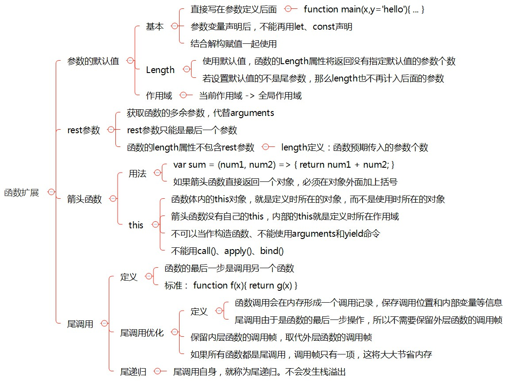
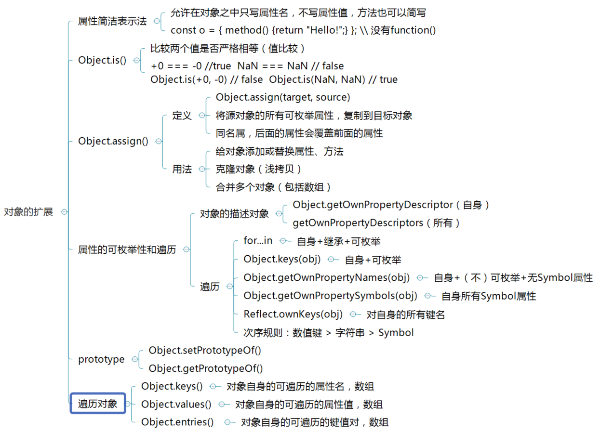
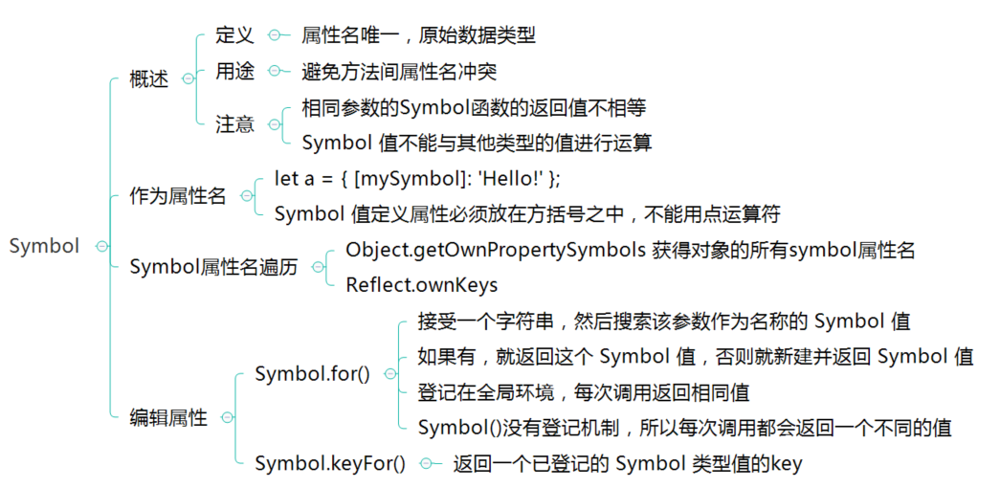

## ES6

> 对于简单概念用思维导图总结，复杂概念加上代码验证

### let const

<div align=center>


</div>

### 解构赋值

<div align=center>


</div>

### 字符串扩展

<div align=center>


</div>

### 数值扩展

<div align=center>


</div>

### 函数扩展

<div align=center>



</div>

```javascript
/* 参数的默认值 - 基本 */
function sum(x, y = 10) {
  return x + y;
}

console.log(sum(1)); // 11
console.log(sum(1, 2)); // 3

/* 参数的默认值 - 解构赋值 */
function fn({x, y = 5}) {
  console.log(x, y);
}

fn({}); // undefined 5
fn({x: 1}); // 1 5
fn({x:1, y: 2}); // 1 2
fn(); // 报错，函数没有默认值，无法解构赋值

/* 参数的默认值 - Length */
(function (a) {}).length // 1
(function (a = 5) {}).length // 0
(function (a, b, c = 5) {}).length // 2

/* 参数的默认值 - 作用域 */
var x = 1; // y=x,y指向x,x指向f(2)
function f(x, y = x) {
  console.log(y);
}
f(2) // 2

let x = 1;
function f(y = x) { // y=x,y指向x,x指向全局变量x
  let x = 2;
  console.log(y);
}
f() // 1

/* rest参数 */
function add(...values) {
  let sum = 0;
  for (let val of values)
    sum += val;
  return sum;
}
console.log(add(1, 2, 3)); // 6

// 报错
function fn(a, ...b, c) {
  // ...
}

/* 箭头函数 - 用法 */
// 如果只有一个参数，可以不用加 ()
// 如果函数只有一条语句，并且是 return 语句，可以省略 return
let square = x => x * x;
console.log(square(2)); // 4


// 如果函数代码块部分多余一条语句，就要用大括号括起来
let sum = (a, b) => {
  let c = a + b;
  return c;
};
console.log(sum(1, 2)); // 3


// 如果函数返回一个对象，需要加上() 以免解析成代码块
// 当然如果不嫌麻烦完全可以直接用 {} 限定代码块，加上 return 语句
let f = () => ({name: 'hanzichi'});
console.log(f()); // { name: 'hanzichi' }


// 和变量解构结合使用
let full = ({first, last}) => first + ' ' + last;
let person = {first: 'hello', last: 'world'};
console.log(full(person)); // Han Zichi

/* 箭头函数 - this */
function foo() {
  setTimeout(() => {
    console.log('id:', this.id);
  }, 1000);
}
var id = 21;
foo.call({ id: 42 }); // id: 42

function Timer() {
  this.s1 = 0;
  this.s2 = 0;
  // this 绑定定义时所在的作用域
  setInterval(() => this.s1++, 1000);
  // this 指向运行时所在的作用域
  setInterval(function() {
    // NaN
    this.s2++;
  }, 1000);
}
let timer = new Timer();
setTimeout(() => console.log(timer.s1, timer.s2), 3100); // 3 0

/* 尾调用 - 定义*/
// 尾调用不一定出现在函数尾部，只要是最后一步操作即可
function f(x) {
  if (x > 0) {
    return m(x);
  }
  return n(x);
}

/* 尾调用 - 尾调用优化*/
// 如果函数 g 不是尾调用，函数 f 就需要保存内部变量 m 和 n 的值、g 的调用位置等信息。
// 但是由于调用 g 之后，函数就结束了，
// 所以执行到最后一步，完全可以删除 f(x) 的调用帧，只保留 g(3) 的调用帧

function f() {
  let m = 1;
  let n = 2;
  return g(m + n);
}
fn();
// 等同于
function f() {
  return g(3);
}
// 等同于
g(3);

// 只有不再用到外层函数的内部变量，内层函数的调用帧才会取代外层函数的调用帧，否则就无法进行 "尾调用优化"
function addOne(a) {
  let one = 1;
  function inner(b) {
    return b + one;
  }
  return inner(a);
}

/* 尾调用 - 尾递归*/
// 尾调用自身，就称为尾递归
// 只存在一个调用帧
function fibonacci(n, a = 1, b = 1) {
  if (n <= 1) return b;
  return fibonacci(n - 1, b, a + b);
}
fibonacci(5) // 8
```

### 数组扩展

<div align=center>


</div>

### 对象扩展

<div align=center>



</div>

```javascript

/* 对象扩展 - 属性简洁表示法 */ 
let a=1;
let b=2;
let es5={
  a:a,
  b:b
};
let es6={
  a,
  b
};
console.log(es5,es6); // ​​​​​{ a: 1, b: 2 } { a: 1, b: 2 }​​​​​

let es5_method={
  hello:function(){
    console.log('hello');
  }
};
let es6_method={
  hello(){
    console.log('hello');
  }
};
console.log(es5_method.hello(),es6_method.hello());

/* 对象扩展 - Object.is() */ 
console.log(Object.is('foo','foo'),'foo'==='foo'); // true true​​​​​
console.log(Object.is(+0,-0),+0===-0); // ​​​​​false true
console.log(Object.is(NaN,NaN),NaN===NaN); // ​​​​​true false​​​​​

/* 对象扩展 - Object.assign() */ 
const target = { a: 1, b: 1 };
const source1 = { b: 2, c: 2 };
const source2 = { c: 3 };
Object.assign(target, source1, source2);
target // {a:1, b:2, c:3}

// undefined和null无法转成对象
Object.assign(undefined) // 报错
Object.assign(null) // 报错

//  Object.assign 拷贝源对象自身属性+可枚举
Object.assign({b: 'c'},
  Object.defineProperty({}, 'invisible', {
    enumerable: false,
    value: 'hello'
  })
) // { b: 'c' }

// 完整克隆一个对象
function clone1(obj) {
  const clone = Object.assign(
    Object.create(Object.getPrototypeOf(obj)),
    obj
  );
  return clone
}

function clone2(obj) {
  // create 第一个参数是对象的原型，第二参数是描述对象
  const clone = Object.create(
    Object.getPrototypeOf(obj),
    Object.getOwnPropertyDescriptors(obj)
  )
  return clone
}

// 数组视为对象处理
Object.assign([1, 2, 3], [4, 5]) // [4, 5, 3]

// 扩展运算符： 取出参数对象的所有可遍历属性，拷贝到当前对象之中。
let z = { a: 3, b: 4 };
let n = { ...z };
n // { a: 3, b: 4 }
```  

### Symbol

<div align=center>



</div>